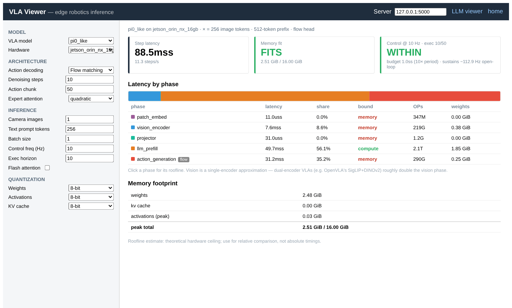

# LLM-Viewer &nbsp;·&nbsp; VLA-Viewer


LLM-Viewer is a tool for visualizing Language Models (LLMs) and analyzing their performance on different hardware platforms via a roofline model — network-wise analysis of peak memory consumption and inference time. See the paper [LLM Inference Unveiled: Survey and Roofline Model Insights](https://arxiv.org/pdf/2402.16363.pdf).

**This fork adds a VLA Viewer** — a roofline analyzer for **Vision-Language-Action (VLA)** models running inference on robotics **edge devices** (NVIDIA Jetson). It reuses LLM-Viewer's roofline engine and op-cost model, and adds the VLA-specific pipeline, edge hardware, and a purpose-built dashboard. The two are kept as **separate products in one app**: `/llm` (cloud LLM serving) and `/vla` (edge robotics), with disjoint model and hardware lists.

---

## VLA Viewer (Vision-Language-Action, edge robotics)



The VLA Viewer models one observe→act inference step as a pipeline of phases —
**patch embed → vision encode → projector → LLM prefill → action generation** —
and reports, for a chosen edge device:

- **per-phase latency / OPs / arithmetic intensity** (memory- vs compute-bound); click a phase for its roofline plot;
- a **memory-fit verdict** vs the device's unified memory capacity;
- a **control-frequency budget** verdict under action chunking — does the policy keep up with the control loop?

### Architecture & inference choices are config options (not separate model variants)

- **Action decoding**: `autoregressive` (OpenVLA-style discrete tokens), `flow` (diffusion / flow-matching chunk, π0 / Octo), or `parallel` (single-pass action expert).
- **Attention**: `quadratic` or `linear` (SARA-RT) for the action expert.
- **Quantization** (weight / activation / KV-cache bits), image resolution → vision tokens, batch size, flash-attention.
- **Control budget** under chunking: a chunk of *H* predicted actions is executed open-loop, so the latency budget is `exec_horizon / control_hz` — not a single control period. **Chunk/horizon length** drives inference latency; **execution horizon** (steps run open-loop before replanning) drives the budget.

### Models

| Preset | Vision | Backbone | Default head | Runs offline |
|---|---|---|---|---|
| `tinyvla_demo` | CLIP-L/14 | TinyLlama-1.1B | autoregressive | ✅ |
| `openvla_7b` | DINOv2-L/14 | Llama-2-7B (ungated mirror) | autoregressive | ✅ |
| `pi0_like` | SigLIP-So400m | Gemma-2B (PaliGemma) + flow expert | flow | ✅ (local params) |

Any backbone can be analyzed with any action decoder — switch it in the **Architecture** panel.

### Edge hardware

Jetson **Orin NX 16GB**, **AGX Orin 64GB**, **AGX Thor (128GB)**. (The LLM Viewer shows datacenter/cloud GPUs; the two lists do not overlap. New devices self-classify via a `category` field in `hardwares/hardware_params.py`.)

### VLA command line

```bash
python3 analyze_vla_cli.py tinyvla_demo jetson_orin_nx_16gb --w_bit 4 --a_bit 8 --kv_bit 8 --control_hz 10
python3 analyze_vla_cli.py pi0_like    jetson_agx_orin_64gb --w_bit 8 --a_bit 8 --kv_bit 8 --control_hz 50
python3 analyze_vla_cli.py tinyvla_demo jetson_orin_nx_16gb --control_hz 10 --exec_horizon 8   # receding-horizon replanning
```

---

## Running locally (both viewers)

The app is a Flask backend + a Vue frontend.

```bash
# Python deps (a dedicated env is recommended)
pip install transformers flask flask_cors easydict numpy

# 1) backend — serves both the LLM (/get_graph) and VLA (/get_vla_graph) endpoints
python3 backend_app.py --local --port 5000

# 2) frontend — in another terminal
cd frontend && npm install && npm run dev
```

Open **http://localhost:5173/** — a landing page links to the two viewers:

- **`/llm`** — the original LLM viewer (cloud GPUs). Set the **Server** dropdown to `127.0.0.1` (default points at the hosted backend).
- **`/vla`** — the VLA viewer (edge devices); defaults its server to `127.0.0.1:5000`.

> NOTE: roofline times are the theoretical hardware ceiling — use them for **relative** comparison, not absolute timings.

---

## Workflow (roofline analysis)


1. Take the model and gather per-layer info: compute count, input/output tensor shapes, data dependencies.
2. Provide the hardware and build a roofline model from its compute capacity and memory bandwidth.
3. Configure inference settings (batch size, sequence/prompt length, generation length; for VLA: image resolution, action chunk, denoising steps, control Hz).
4. Configure optimization settings (quantization bitwidth, FlashAttention, decoding/attention method).
5. The analyzer evaluates each op against the roofline, tracks memory usage, and aggregates to the whole network (and, for VLA, to the multi-phase pipeline).
6. Report per-layer/phase performance, bottlenecks, and memory footprint; for VLA, the memory-fit and control-budget verdicts.
7. Explore interactively in the web viewer.

## LLM command line

```bash
pip install transformers flask flask_cors easydict
python3 analyze_cli.py facebook/opt-125m nvidia_A6000
python3 analyze_cli.py meta-llama/Llama-2-7b-hf nvidia_A6000 --batchsize 1 --seqlen 2048
# DiT models
python3 analyze_cli.py DiT-XL/2 nvidia_A6000 --batchsize 1 --seqlen 256 --source DiT
```

The hosted LLM viewer is at [LLM-Viewer Web](http://llm-viewer.com).

## Citation

If you use LLM-Viewer in your research, please cite the paper:

```
@misc{yuan2024llm,
      title={LLM Inference Unveiled: Survey and Roofline Model Insights},
      author={Zhihang Yuan and Yuzhang Shang and Yang Zhou and Zhen Dong and Chenhao Xue and Bingzhe Wu and Zhikai Li and Qingyi Gu and Yong Jae Lee and Yan Yan and Beidi Chen and Guangyu Sun and Kurt Keutzer},
      year={2024},
      eprint={2402.16363},
      archivePrefix={arXiv},
      primaryClass={cs.CL}
}
```
